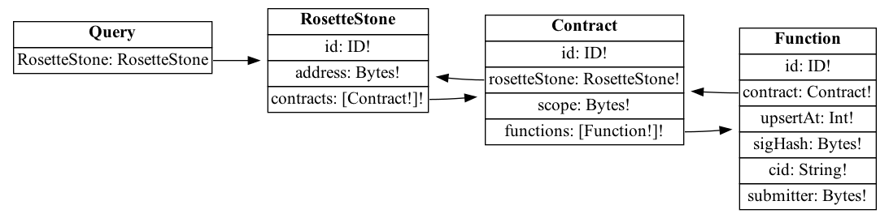

# Rosette Subgraph 🛰

Subgraph for [Rosette protocol](https://github.com/BlossomLabs/rosette-contracts).

## Current deployed subgraphs

| Network | TheGraph                                                                                        | HTTP endpoint                                                            |
| ------- | ----------------------------------------------------------------------------------------------- | ------------------------------------------------------------------------ |
| goerli  | [Hosted Service](https://thegraph.com/hosted-service/subgraph/blossomlabs/rosette-stone-goerli) | https://api.thegraph.com/subgraphs/name/blossomlabs/rosette-stone-goerli |

## Schema



## Query example

The example show how to query a list of Gardens.

```graphql
  contract(id: "${contractId}") {
    functions {
        id
        cid
        notice
        sigHash
        submitter
        upsertAt
    }
  }
```
